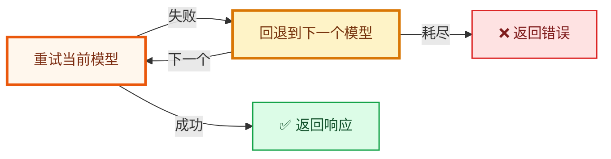

# HydraLLM

[English](README.md) | 简体中文 | [日本語](README_JP.md)



HydraLLM 是一个高性能 LLM API 代理，支持自动重试与模型回退，可在 OpenAI 兼容、Anthropic 兼容和 AWS Bedrock 提供商之间工作。

当请求失败时，HydraLLM 会先重试当前模型，再按配置顺序回退到下一个模型，直到成功或全部耗尽。

> [!TIP]
> 完整配置字段与示例请查看 [CONFIGURATION.md](CONFIGURATION.md)。

## ✨ 为什么选择 HydraLLM

- 为编码与 Agent 场景提供自动重试 + 回退。
- 多提供商支持：OpenAI 兼容、Anthropic 兼容、AWS Bedrock。
- 提供稳定的本地统一入口，即使模型链变化也能平滑接入。

## 📦 安装

### Homebrew（macOS / Linux）

```bash
brew install fang2hou/tap/hydrallm
```

### 通过 Go 安装（全平台）

```bash
go install github.com/fang2hou/hydrallm@latest
```

### 下载已编译二进制（全平台）

从 [GitHub Releases](https://github.com/fang2hou/hydrallm/releases) 下载。

## 🚀 快速开始（GLM Coding Plan）

本项目提供的 GLM showcase 在同一份配置中提供两个监听端口：

- OpenAI 兼容 API：`http://127.0.0.1:8101`
- Anthropic 兼容 API：`http://127.0.0.1:8102`

### 1) 准备配置

**macOS / Linux：**

```bash
mkdir -p ~/.config/hydrallm
curl -o ~/.config/hydrallm/config.toml \
  https://raw.githubusercontent.com/fang2hou/hydrallm/main/showcases/glm-coding-plan.toml
```

**Windows（PowerShell）：**

```powershell
New-Item -ItemType Directory -Force -Path "$env:USERPROFILE\.config\hydrallm"
Invoke-WebRequest -Uri "https://raw.githubusercontent.com/fang2hou/hydrallm/main/showcases/glm-coding-plan.toml" -OutFile "$env:USERPROFILE\.config\hydrallm\config.toml"
```

### 2) 设置 API Key

**macOS / Linux：**

```bash
export ZAI_API_KEY="your-api-key"
```

**Windows（PowerShell）：**

```powershell
$env:ZAI_API_KEY = "your-api-key"
```

### 3) 启动代理

```bash
hydrallm
```

### 4) 验证监听端口

<details>
<summary><b>OpenAI 兼容监听端口（8101）</b></summary>

```bash
curl http://127.0.0.1:8101/v1/chat/completions \
  -H "Content-Type: application/json" \
  -d '{
    "model": "placeholder",
    "messages": [{"role": "user", "content": "Say hello"}]
  }'
```

</details>

<details>
<summary><b>Anthropic 兼容监听端口（8102）</b></summary>

```bash
curl http://127.0.0.1:8102/v1/messages \
  -H "Content-Type: application/json" \
  -d '{
    "model": "placeholder",
    "max_tokens": 64,
    "messages": [{"role": "user", "content": "Say hello"}]
  }'
```

</details>

> [!NOTE]
> HydraLLM 会把请求中的 `model` 覆盖为该监听端口配置的模型链。

## 🔁 服务模式（开机自启）

可使用 Homebrew services 实现自动启动。

> [!NOTE]
> 使用 `brew services` 时，请在配置文件中显式设置 `api_key`，不要依赖 shell 环境变量。

```bash
brew services start hydrallm
brew services info hydrallm
brew services restart hydrallm
brew services stop hydrallm
```

- macOS：`launchd`（登录后自动启动）
- Linux：`systemd`

## 🛠️ CLI 命令

| 命令 | 说明 |
|---|---|
| `hydrallm` | 启动服务 |
| `hydrallm serve` | 启动代理 |
| `hydrallm edit` | 用 `$EDITOR` 打开配置 |
| `hydrallm version` | 输出版本信息 |
| `hydrallm --help` | 查看帮助 |

全局参数：`--config /path/to/config.toml`、`--log-level info`

## 🧯 故障排查

快速诊断：

```bash
hydrallm --config /path/to/config.toml --log-level debug
brew services list | grep hydrallm
```

<details>
<summary><b>配置校验失败：至少需要配置一个模型（config validation failed: at least one model must be configured）</b></summary>

在 `[models.<id>]` 下至少配置一个模型。

</details>

<details>
<summary><b>模型 "..."：未找到提供商 "..."（model "...": provider "..." not found）</b></summary>

确保每个模型的 `provider` 都能在 `[providers.<name>]` 中找到对应项。

</details>

<details>
<summary><b>监听器 "..."：不允许混用模型类型（listener "...": mixed model types are not allowed）</b></summary>

同一个 listener 里所有模型必须是同一 API 类型（`openai`、`anthropic` 或 `bedrock`）。
请把混合类型拆分到多个 listener。

</details>

<details>
<summary><b>请求返回上游 4xx/5xx（Requests return upstream 4xx/5xx）</b></summary>

可临时设置 `log.include_error_body = true`，查看上游错误详情。

</details>

## 📄 许可证

MIT
