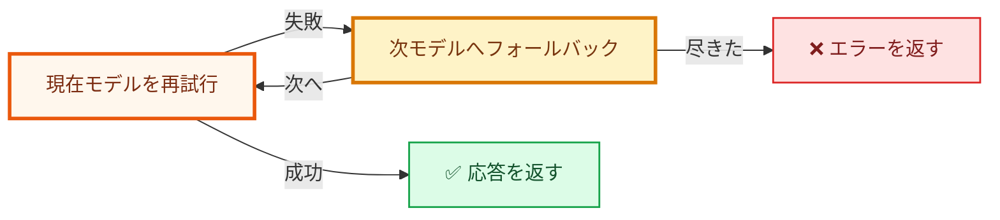

# HydraLLM

[English](README.md) | [简体中文](README_CN.md) | 日本語



HydraLLM は、自動再試行とモデルフォールバックを備えた高性能な LLM API プロキシです。OpenAI 互換、Anthropic 互換、AWS Bedrock に対応します。

リクエストが失敗すると、HydraLLM は現在のモデルを再試行し、必要に応じて設定済みの次モデルへフォールバックします。成功するか、すべての候補を試し切るまで処理を継続します。

> [!TIP]
> 設定項目の完全な一覧と例は [CONFIGURATION.md](CONFIGURATION.md) を参照してください。

## ✨ HydraLLM が選ばれる理由

- コーディング / エージェントワークロード向けの自動再試行 + フォールバック。
- OpenAI 互換、Anthropic 互換、AWS Bedrock のマルチプロバイダー対応。
- モデルチェーンが変わっても、ローカルの単一エンドポイントで安定運用。

## 📦 インストール

### Homebrew（macOS / Linux）

```bash
brew install fang2hou/tap/hydrallm
```

### Go でインストール（全プラットフォーム）

```bash
go install github.com/fang2hou/hydrallm@latest
```

### バイナリをダウンロード（全プラットフォーム）

[GitHub Releases](https://github.com/fang2hou/hydrallm/releases) から取得できます。

## 🚀 クイックスタート（GLM Coding Plan）

このプロジェクトに含まれる GLM showcase では、1 つの設定で 2 つのリスナーを利用できます。

- OpenAI 互換 API: `http://127.0.0.1:8101`
- Anthropic 互換 API: `http://127.0.0.1:8102`

### 1) 設定ファイルを準備

**macOS / Linux:**

```bash
mkdir -p ~/.config/hydrallm
curl -o ~/.config/hydrallm/config.toml \
  https://raw.githubusercontent.com/fang2hou/hydrallm/main/showcases/glm-coding-plan.toml
```

**Windows（PowerShell）:**

```powershell
New-Item -ItemType Directory -Force -Path "$env:USERPROFILE\.config\hydrallm"
Invoke-WebRequest -Uri "https://raw.githubusercontent.com/fang2hou/hydrallm/main/showcases/glm-coding-plan.toml" -OutFile "$env:USERPROFILE\.config\hydrallm\config.toml"
```

### 2) API キーを設定

**macOS / Linux:**

```bash
export ZAI_API_KEY="your-api-key"
```

**Windows（PowerShell）:**

```powershell
$env:ZAI_API_KEY = "your-api-key"
```

### 3) プロキシを起動

```bash
hydrallm
```

### 4) リスナーを確認

<details>
<summary><b>OpenAI 互換 リスナー（8101）</b></summary>

```bash
curl http://127.0.0.1:8101/v1/chat/completions \
  -H "Content-Type: application/json" \
  -d '{
    "model": "placeholder",
    "messages": [{"role": "user", "content": "Say hello"}]
  }'
```

</details>

<details>
<summary><b>Anthropic 互換 リスナー（8102）</b></summary>

```bash
curl http://127.0.0.1:8102/v1/messages \
  -H "Content-Type: application/json" \
  -d '{
    "model": "placeholder",
    "max_tokens": 64,
    "messages": [{"role": "user", "content": "Say hello"}]
  }'
```

</details>

> [!NOTE]
> HydraLLM は、各リスナーで設定したモデルチェーンに基づいて、リクエストの `model` を上書きします。

## 🔁 サービス運用（自動起動）

Homebrew services を使うと自動起動を設定できます。

> [!NOTE]
> `brew services` を使う場合は、`api_key` を設定ファイルに明示してください。シェルの環境変数だけに依存しないでください。

```bash
brew services start hydrallm
brew services info hydrallm
brew services restart hydrallm
brew services stop hydrallm
```

- macOS: `launchd`（ログイン後に自動起動）
- Linux: `systemd`

## 🛠️ CLI コマンド

| コマンド | 説明 |
|---|---|
| `hydrallm` | サーバー起動 |
| `hydrallm serve` | プロキシ起動 |
| `hydrallm edit` | `$EDITOR` で設定を編集 |
| `hydrallm version` | バージョン情報を表示 |
| `hydrallm --help` | ヘルプを表示 |

グローバルフラグ：`--config /path/to/config.toml`、`--log-level info`

## 🧯 トラブルシューティング

クイック診断：

```bash
hydrallm --config /path/to/config.toml --log-level debug
brew services list | grep hydrallm
```

<details>
<summary><b>設定検証に失敗：少なくとも 1 つのモデルが必要です（config validation failed: at least one model must be configured）</b></summary>

`[models.<id>]` に最低 1 つのモデルを追加してください。

</details>

<details>
<summary><b>model "..."：provider "..." が見つかりません（model "...": provider "..." not found）</b></summary>

各モデルの `provider` が `[providers.<name>]` に存在するキーと一致しているか確認してください。

</details>

<details>
<summary><b>listener "..."：モデルタイプを混在できません（listener "...": mixed model types are not allowed）</b></summary>

1 つの listener 内では、モデルの API タイプ（`openai` / `anthropic` / `bedrock`）を混在できません。
タイプごとに listener を分けて設定してください。

</details>

<details>
<summary><b>リクエストが上流で 4xx/5xx を返す（Requests return upstream 4xx/5xx）</b></summary>

`log.include_error_body = true` を一時的に有効化すると、上流エラーの詳細を確認できます。

</details>

## 📄 ライセンス

MIT
